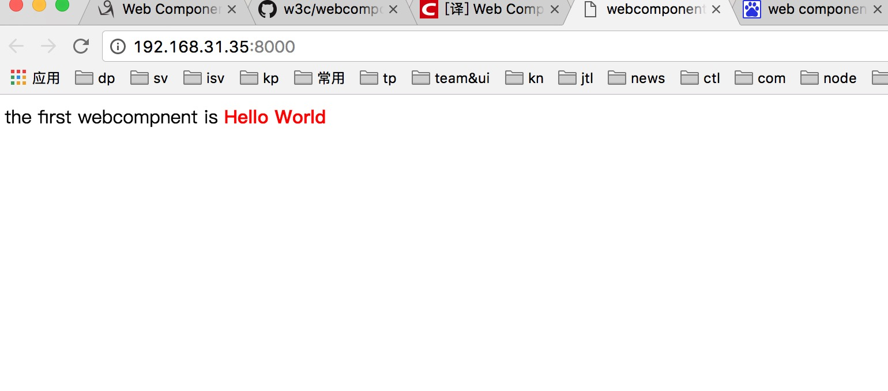

#### Web Components 是什么  

Web Components是一个浏览器的新功能，提供了一个面向web包括下面几个方面标准的组件模型。    

你可以认为Web Components是一个可复用的用户接口部件，  
属于浏览器的一部分，所以不需要一些额外的例如jQuery或者Dojo之类的工具库。  
一个存在的Web Components的使用完全不需要写代码，  
仅仅需要在HTML中加一个import 语句就可以了。   
Web Components使用了一些新颖并且在开发中的浏览器功能。  


上面提到的部分当前在浏览器中可以正常的运行，但是有好多Web Components可以用来创造的部分没有被提及。  
使用Web Components 你几乎可以来做任何可以使用HTML,CSS,JS能做到的事情，并且可以更便捷的被复用。  

有时候关于Web Components和谷歌的plymer之间可能会存在一些困惑   
简介而论，Polymer是基于Web Components技术的一个框架，你当然可以在不适用其的情况下开发Web Components      

Web Components并没有被所有浏览器来实现(截止2017年chrome已经完全支持，其他浏览器还在投票表决中),因此如果在不支持的浏览器上使用Web Components， 
应该使用由google polymer开发的 polyfills来达到目的。使用之前最好通过[Are We Componentized Yet](http://jonrimmer.github.io/are-we-componentized-yet/)查看浏览器兼容性。  


Web Components 包括以下四种技术(每种都可以被单独使用)  

*  Custom Elements  自定义元素 
*  HTML Templates  html模板
*  Shadow DOM  
*  HTML Imports  

明确的文档定义如下：   

*   一种新的html元素: <template>    
*   关于<template> 的接口： HTMLTemplateElement, HTMLContentElement (removed from spec) and HTMLShadowElement   
*   HTMLLinkElement接口和 <link> 元素的扩展  
*   注册custom elements的接口：Document.registerElement()和对Document.createElement() and Document.createElementNS()的更新    
*   对html元素原型对象新增的生命周期回调   
*   默认为元素对象增加的新的css的伪类：:unresolved   
*   The Shadow DOM：ShadowRoot and Element.createShadowRoot(), Element.getDestinationInsertionPoints(), Element.shadowRoot   
*   Event接口的扩展、Event.path  
*   Document 接口的一些扩展  
*   Web Components样式应用新的伪类：:host, :host(), :host-context()
 


#### Shadow DOM
    明确的定义如下：  
    一种可以在document下组合多个同级别并且可以项目作用的DOM树的方法，因此可以更好完善DOM的构成   

#### Custom Elements   
     定义如下：  
     一种可以允许开发者在document中定义并使用的新的dom元素类型，即自定义元素     

#### HTML Templates   
     模板没什么可说了，在标准实现之前其实我们一直都在用js来实现该方式
#### HTML Imports  
     一种允许一个html文档在别的htmldocuments中包含和复用的方法   

## 如何使用 
    接下看最直接的还是hello world 。直接上代码：
#### index.html  
```html
   <!DOCTYPE>
<html>
    <head>
        <title>webcomponent</title>
        <link rel="import" href="./components/helloword.html" />
    </head>
    <body>
        <hellow-world></hellow-world>
    </body>
</html> 
```   
#### helloworld.html  
```html
    <template>
    <style>
        .coloured {
            color: red;
        }
    </style>
    <p>the first webcompnent is  <strong class="coloured">Hello World</strong></p>
</template>
<script>
    (function() {
        // Creates an object based in the HTML Element prototype
        // 基于HTML Element prototype 创建obj
        var element = Object.create(HTMLElement.prototype);
        // 获取特mplate的内容
        var template = document.currentScript.ownerDocument.querySelector('template').content;
        // element创建完成之后的回调
        element.createdCallback = function() {
            // 创建 shadow root
            var shadowRoot = this.createShadowRoot();
            // 向root中加入模板
            var clone = document.importNode(template, true);
            shadowRoot.appendChild(clone);
        };
        document.registerElement('hellow-world', {
            prototype: element
        });
    }());
</script>
```     
#### 运行结果  

